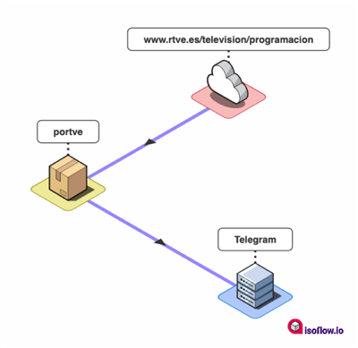

# portve

Notify scheduled programs on RTVE based on certain criteria.

## Justification

This project started because I wanted to be informed about the spanish TV broadcasts of [Olympic Games Tokyo 2020](https://olympics.com/tokyo-2020/). I wanted to get notifications everyday about what sports on which channel and at what time are shown.

This idea can be generalized: Through a list of user defined **search terms** this tool scrap the daily TV schedules published in [RTVE channels](https://www.rtve.es/television/programacion/) and notify them using a [Telegram Bot](https://core.telegram.org/bots).



## Installation

Create a Python3 virtualenv and install the requirements inside:

```console
$ pip install -r requirements.txt
```

## Usage

Define, at least, the following settings in an `.env` file:

- `SEARCH_TERMS`: comma separated terms to be searched.
- `TELEGRAM_BOT_TOKEN`: token for the Telegram Bot.
- `TELEGRAM_CHANNEL_ID`: Telegram channel where the Bot will notify.

Launch the tool with:

```console
$ python main.py
```

### Timezone

The target timezone can be managed with the setting `TARGET_TZ` in `.env` file [using this format](https://en.wikipedia.org/wiki/List_of_tz_database_time_zones). Default is `UTC`.
